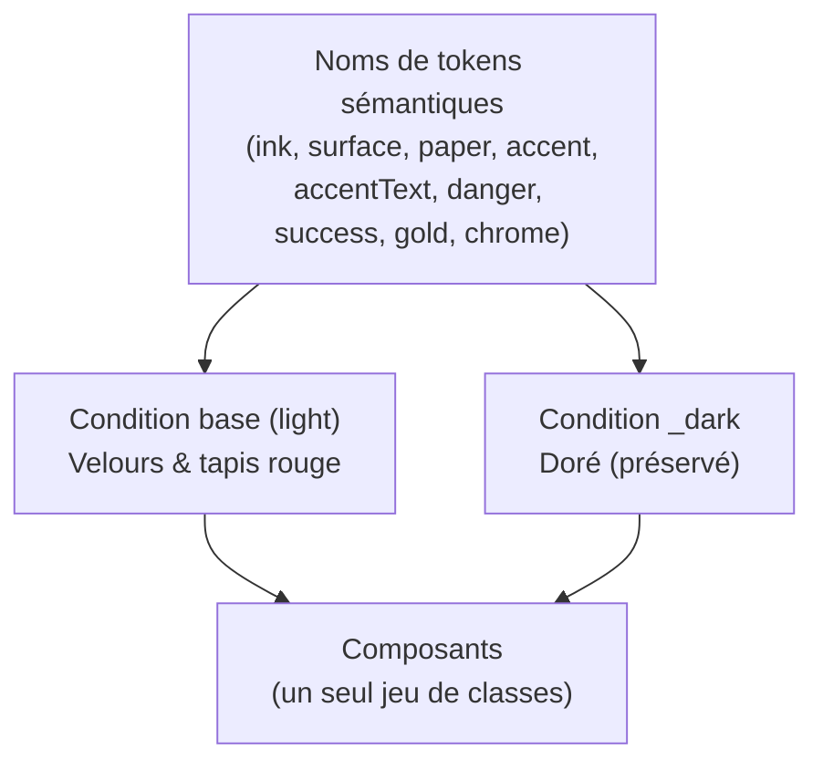
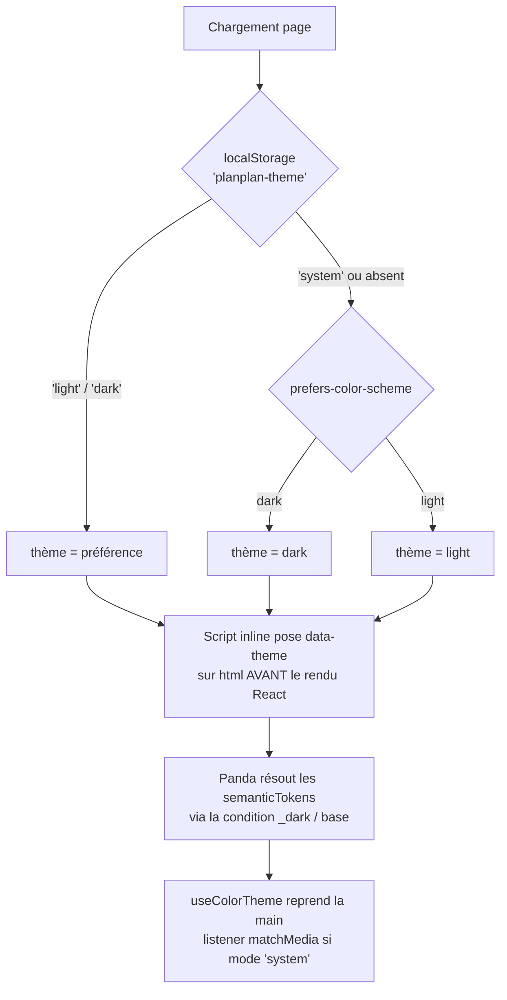

# Design System bi-thème — light rouge cinéma - Plan

## Goal Capsule

- **Objectif :** ajouter un light theme cinéma « Velours & tapis rouge » (accent rouge) à côté du thème sombre doré existant, en faisant passer les couleurs de Plan-Plan d'une palette plate à une couche de tokens sémantiques commutables.
- **Autorité produit :** Dylan (propriétaire du projet, décideur design).
- **Profil d'exécution :** travail de config/UI styling ; preuve par `panda codegen` + `tsc` + `build` + `lint` + matrice de smoke manuelle. Aucun test runner dans le repo (voir Assumptions).
- **Blocages ouverts :** aucun. Les décisions déférées par le brainstorm (placement du toggle, tri-state, mécanisme de switch) sont tranchées ci-dessous en Key Technical Decisions.

---

## Product Contract

**Product Contract preservation :** inchangé, sauf une clarification (non substantielle) — le contrôle de thème (R11) est un composant intrinsèque à la fonctionnalité de theming, pas une « refonte UI » ; il ne contredit pas la borne « pas de nouveaux composants » de Scope Boundaries, qui vise les composants de contenu/feature. R-IDs préservés.

### Summary

On introduit un design system à deux thèmes pour Plan-Plan. Le thème sombre doré actuel reste inchangé ; on ajoute un light theme cinéma à accent cramoisi, papier crème et or en micro-touche. La palette plate (`web/panda.config.ts`) devient sémantique — un même nom de token résout la bonne valeur selon le thème actif — ce qui permet un switch qui suit l'OS au premier chargement avec override manuel mémorisé.

### Problem Frame

La palette actuelle est une palette plate : chaque token porte une valeur unique et figée (fonds bruns sombres, texte crème, accent or `#e8a33d`), et plusieurs couleurs vivent hors du système de tokens (le rouge d'erreur `red.400`, un vert codé en dur dans le tiroir d'abonnement, la couleur de texte sur accent, et plusieurs surfaces/motifs translucides figés en sombre). Cette structure interdit tout changement de thème : il n'existe aucune notion de « valeur selon le contexte ».

Le souhait — un accent rouge — entre par ailleurs en tension avec la convention rouge = danger. Comme un rouge d'erreur et un rouge de marque proches sèment le doute, ignorer ce conflit produirait une UI où l'utilisateur ne sait plus si une zone rouge est une action ou une alerte. Le chantier n'est donc pas « ajouter des couleurs » mais « poser une couche de theming et y différencier proprement l'accent du danger ».

### Key Decisions

- **Rouge assumé comme accent de marque.** Le rouge cramoisi devient l'accent malgré la convention danger. Plutôt que d'éviter le rouge pour l'erreur, on différencie le danger par la température (vermillon plus froid et plus vif) et on le double d'un signal non-coloré (icône + `role="alert"`).
- **Défaut « suit l'OS », pas de thème canonique.** Aucun thème n'est « le défaut » : l'OS décide au premier chargement. Conséquence directe — le light doit être un citoyen de première classe, complet et à parité avec le dark, y compris pour les surfaces de chrome (en-tête, nav, motifs), puisqu'un visiteur sous OS clair le verra en premier.
- **Or conservé en héritage.** Le light garde un token or en micro-touche (ex. coup de cœur), en écho à l'accent du thème sombre, plutôt qu'une palette rouge + neutres seuls.
- **Direction visuelle « Velours & tapis rouge ».** Cramoisi chaud + papier crème, esprit soirée de première, cohérent avec la chaleur du thème sombre existant. Valeurs validées visuellement pendant le brainstorm (voir table ci-dessous), directionnelles et ajustables au contraste à l'implémentation.

La restructuration en tokens sémantiques alimente les deux thèmes depuis une seule source de noms :

### Requirements

**Fondation theming**

- R1. Le système de couleurs passe de tokens plats à des tokens sémantiques avec conditions light/dark : un même nom de token résout la valeur correcte selon le thème actif.
- R2. Les deux thèmes sont à parité complète : chaque token sémantique défini pour un thème a son équivalent dans l'autre ; aucune surface — y compris chrome et motifs translucides — ne rend une couleur indéfinie ou inadaptée au thème.
- R3. Toutes les couleurs codées hors du système de tokens sont rapatriées en tokens sémantiques (conditionnels) : le rouge d'erreur `red.400` ([CatalogPage.tsx:88](web/src/pages/CatalogPage.tsx#L88) + équivalent [ManageSubscriptionPage.tsx](web/src/pages/ManageSubscriptionPage.tsx)) ; le vert « copié » `rgba(95,184,122,…)` de [SubscribeDrawer.tsx](web/src/components/SubscribeDrawer.tsx) ; `accentText` ; **et les surfaces/motifs translucides aujourd'hui figés en sombre** — fond d'en-tête collant `rgba(15,13,11,0.68)` ([CatalogPage.tsx:37](web/src/pages/CatalogPage.tsx#L37)), fond de barre de nav `rgba(26,22,19,0.75)` ([BottomNav.tsx:39](web/src/components/BottomNav.tsx#L39)), motif de carte `repeating-linear-gradient(… rgba(246,241,231,…))` ([MovieCard.tsx:117](web/src/components/MovieCard.tsx#L117)), pouce de scrollbar `rgba(246,241,231,0.15)` du `globalCss` ([panda.config.ts:45](web/panda.config.ts#L45)). Sans ça, un visiteur sous OS clair verrait ces chromes sombres flotter sur le crème (viole R2).
- R4. `accentText` (couleur du texte/icône posé sur le remplissage accent) résout par thème : encre foncée sur l'accent or en dark, crème claire sur l'accent cramoisi en light.

**Light theme — Velours & tapis rouge**

- R5. Un nouveau light theme est ajouté (fonds papier crème chaud, texte encre chaude, accent cramoisi profond), le thème sombre doré existant restant inchangé.
- R6. Un token or est disponible comme micro-accent rare du light theme, en écho à l'accent du dark.
- R7. Les valeurs de palette suivent la table ci-dessous ; elles sont directionnelles et ajustables au contraste, mais validées visuellement pendant le brainstorm.

**Différenciation du danger**

- R8. Un token sémantique `danger` distinct de `accent` existe dans les deux thèmes : un vermillon plus froid/vif (`#D22B36` light / `#F0565B` dark) face à l'accent cramoisi/or chaud.
- R9. Les états d'erreur associent la couleur danger à un signal non-coloré (icône + `role="alert"`) pour que le message se lise comme une erreur même à proximité de zones accent rouges.

**Comportement du switch**

- R10. Au premier chargement sans préférence stockée, le thème actif suit `prefers-color-scheme` de l'OS.
- R11. Un contrôle visible permet de forcer le thème ; le choix est persisté et prime sur la préférence OS aux visites suivantes.
- R12. Le thème appliqué ne produit aucun flash du mauvais thème au chargement (thème résolu avant le premier paint) — cf. caveat dev Vite en KTD2.

### Palette reference

Valeurs validées au brainstorm — directionnelles, à confirmer au contraste. La colonne « token » est le nom conservé dans `semanticTokens` (voir KTD1).

| Rôle | Token conservé | Light — Velours & tapis rouge (base) | Dark — Doré (`_dark`, préservé) |
|---|---|---|---|
| Fond page | `ink` | `#F7F2E8` papier crème | `#0f0d0b` |
| Carte | `surface` | `#FFFDF9` | `#211c18` |
| Carte surélevée | `surfaceRaised` | `#FBF6EC` | `#1a1613` |
| Feuille/drawer | `surfaceSheet` | `#F1E8D8` | `#1f1a16` |
| Fond en-tête collant | `headerBg` | `rgba(247,242,232,0.72)` | `rgba(15,13,11,0.68)` |
| Fond barre de nav | `navBg` | `rgba(255,253,249,0.80)` | `rgba(26,22,19,0.75)` |
| Pouce scrollbar | `scrollThumb` | `rgba(26,19,16,0.15)` | `rgba(246,241,231,0.15)` |
| Filet/motif | `hairline` | `rgba(26,19,16,0.05)` | `rgba(246,241,231,0.06)` |
| Filet/motif ténu | `hairlineFaint` | `rgba(26,19,16,0.02)` | `rgba(246,241,231,0.02)` |
| Bordure | `border` | `rgba(26,19,16,0.10)` | `rgba(246,241,231,0.06)` |
| Bordure forte | `borderStrong` | `rgba(26,19,16,0.18)` | `rgba(246,241,231,0.12)` |
| Texte primaire | `paper` | `#1A1310` encre chaude | `#f6f1e7` |
| Texte atténué | `paperMuted` | `rgba(26,19,16,0.55)` | `rgba(246,241,231,0.5)` |
| Texte ténu | `paperFaint` | `rgba(26,19,16,0.35)` | `rgba(246,241,231,0.3)` |
| Accent | `accent` | `#A11220` cramoisi | `#e8a33d` or |
| Accent doux | `accentSoft` | `rgba(161,18,32,0.10)` | `rgba(232,163,61,0.12)` |
| Bordure accent | `accentBorder` | `rgba(161,18,32,0.35)` | `rgba(232,163,61,0.4)` |
| Texte sur accent | `accentText` | `#FDF6EC` crème | `#1a1310` encre |
| Or micro-accent | `gold` | `#C8912F` | `#e8a33d` |
| Succès | `success` | `#3F9D5C` | `#5fb87a` |
| Succès doux | `successSoft` | `rgba(63,157,92,0.12)` | `rgba(95,184,122,0.12)` |
| Bordure succès | `successBorder` | `rgba(63,157,92,0.4)` | `rgba(95,184,122,0.4)` |
| Danger | `danger` | `#D22B36` vermillon | `#F0565B` vermillon |
| Danger doux | `dangerSoft` | `rgba(210,43,54,0.10)` | `rgba(240,86,91,0.14)` |

### Acceptance Examples

- AE1. **Couvre R10.** Premier chargement, OS en clair, aucune préférence stockée → le light Velours s'affiche, y compris en-tête, nav et motifs en tons clairs.
- AE2. **Couvre R11.** L'utilisateur bascule sur dark puis recharge → le dark s'affiche même si l'OS est en clair ; le choix persiste.
- AE3. **Couvre R11, R10.** L'utilisateur remet le contrôle sur « Système » → l'app suit à nouveau l'OS, y compris si l'OS change de thème à chaud.
- AE4. **Couvre R8, R9.** Une erreur de chargement survient en light theme → message en vermillon avec icône et `role="alert"`, visuellement distinct des boutons cramoisi voisins.
- AE5. **Couvre R12.** Rechargement (build de prod) avec préférence dark stockée sous OS clair → aucun flash clair avant l'affichage du dark.

### Scope Boundaries

- Aucune refonte UI au-delà de la couleur/theming : pas de nouveaux composants de contenu, pas de changement de layout, pas de typographie. (Le contrôle de thème et l'icône d'erreur sont intrinsèques à R11/R9, cf. preservation note.)
- Pas de theming par cinéma ni de thèmes supplémentaires au-delà de ces deux-là.
- Aucun changement de données ou d'ingestion.
- Identité visuelle du dark inchangée : ses valeurs `_dark` restent identiques à l'actuel ; il ne gagne que de nouveaux tokens (`danger`, `gold`, `successSoft`/`successBorder`, `headerBg`/`navBg`/`scrollThumb`/`hairline`/`hairlineFaint`) dont les valeurs `_dark` reprennent exactement les littéraux actuels.

#### Deferred to Follow-Up Work

- Introduction d'un test runner (vitest) pour couvrir `resolveTheme` en unitaire — hors périmètre ici (le repo n'a aucun test aujourd'hui).
- Ajustement fin des hex au contraste WCAG après revue visuelle sur device.

### Dependencies / Assumptions

- Panda CSS `@pandacss/dev ^1.11.4` supporte `semanticTokens` à valeurs conditionnelles `{ base, _dark }` et la surcharge de conditions via `conditions.extend` — hypothèse ancrée sur la version installée ; surcharge exacte validée au `panda codegen` de U1 (cf. KTD1).
- Préférence persistée en `localStorage` ; un set du `data-theme` avant le premier paint (script inline dans `web/index.html`) tient R12 sur le build de prod.
- Accessibilité : l'accent cramoisi sur crème et le vermillon danger doivent atteindre les ratios de contraste pour texte/icône (vérification visuelle ; ajustement fin déféré).

### Outstanding Questions

**Déféré à l'implémentation**

- Confirmer au `panda codegen` de U1 que la surcharge de la condition `_dark` produit bien le sélecteur `[data-theme=dark] &` attendu (mécanisme retenu en KTD1).
- Valeurs hex finales ajustées au contraste à partir de la table de palette.

---

## Planning Contract

### Key Technical Decisions

- **KTD1. Theming via `semanticTokens` Panda + surcharge de la condition `_dark`, noms de tokens conservés.** On migre `theme.extend.tokens.colors` (plat) vers `theme.extend.semanticTokens.colors`, chaque token portant `{ value: { base: <light>, _dark: <dark> } }`. Point critique : on **surcharge directement la clé de condition intégrée `_dark`** de Panda pour la lier à `[data-theme=dark] &` (via `conditions.extend`), plutôt que d'introduire une condition nommée `dark` distincte — sinon les valeurs `_dark` des tokens seraient résolues contre le sélecteur `_dark` **par défaut** de Panda (basé color-mode/`.dark`) et le switch `data-theme` n'aurait aucun effet. `base` = light (défaut dès que `data-theme` ≠ `dark`). Les **noms de tokens existants sont conservés** (`ink`, `surface`, `paper`, `accent`, `accentText`, `success`…) : leur rôle est stable, seule la valeur devient conditionnelle — churn minimal sur les composants. Source de vérité unique : l'attribut `data-theme` sur `<html>`.
- **KTD2. Résolution du thème = fonction pure + script pré-paint.** Une fonction pure `resolveTheme(pref, osPrefersDark) → 'light' | 'dark'` (dans `web/src/lib/theme.ts`) centralise la logique. Un script inline dans `web/index.html` l'exécute avant le montage React : il lit `localStorage['planplan-theme']` puis, si absent/`system`, `matchMedia('(prefers-color-scheme: dark)')`, et pose `document.documentElement.dataset.theme`. Le hook React réutilise la même fonction pure. **Attention source unique :** le script inline s'exécute avant le bundle et ne peut pas importer le module TS ; il ré-implémente donc la résolution en JS vanilla. Garder les deux en phase (même clé `planplan-theme`, même logique `stored → matchMedia`) ; la logique est petite et figée, mais toute évolution doit toucher les deux. En dev Vite (CSS injecté par JS) un léger flash reste possible ; R12/AE5 valent pour le build de prod (CSS extrait dans un `<link>` du `<head>`).
- **KTD3. Contrôle tri-state Système / Clair / Sombre, en `radiogroup`.** La préférence stockée vaut `'system' | 'light' | 'dark'`. Comme le défaut suit l'OS, un toggle binaire ne pourrait pas revenir à « système » — le tri-state le permet (résout la question déférée par le brainstorm). En mode `system`, un listener `matchMedia` réagit aux changements d'OS à chaud (AE3). Implémenté en **`role="radiogroup"`** (trois `role="radio"` Système/Clair/Sombre), navigation flèches + roving `tabindex`, `aria-checked` sur l'option active ; l'état actif est porté par **un fond plein (token) + `aria-checked`**, jamais par la seule couleur ; cible tactile ≥ 44×44px par option.
- **KTD4. Placement du contrôle : en-tête haut-droite de chaque page.** Pas de nouveau layout partagé (le repo n'en a pas) ; `ThemeToggle` est inséré dans la rangée d'en-tête de `CatalogPage` et `ManageSubscriptionPage`. Décision de moindre surface, cohérente avec Scope Boundaries.
- **KTD5. Différenciation danger + migration des surfaces dans les composants.** Le `red.400` brut des états d'erreur devient le token `danger`, doublé d'une icône d'alerte (triangle-exclamation, en tête de message, `aria-hidden="true"` pour que le texte `role="alert"` reste le seul contenu annoncé), colorée avec `danger`. Le vert codé en dur de `SubscribeDrawer` passe sur `success`/`successSoft`/`successBorder`. **Les surfaces/motifs translucides sombres** (en-tête, nav, motif de carte, pouce de scrollbar) passent sur les nouveaux tokens `headerBg`/`navBg`/`hairline`/`hairlineFaint`/`scrollThumb`.

### High-Level Technical Design

Résolution du thème au chargement (pré-paint) :

### Assumptions

- **Pas de test runner dans le repo.** Au-delà de `prepare` (codegen) et `build`, `web/package.json` n'expose comme vérif que `lint` (oxlint) et `typecheck` (tsc) ; aucun runner de test (vitest/jest). La vérification comportementale se fait donc par codegen + typecheck + build + lint + matrice de smoke manuelle (Verification Contract). Introduire un runner pour tester `resolveTheme` en unitaire est déféré (Scope Boundaries) ; la fonction est néanmoins extraite pure pour rester testable plus tard. **Exception de test délibérée** motivée par l'absence d'infrastructure et la nature config/UI du changement.
- **Recherche externe non lancée :** Panda est le système de style déjà en place ; le seul détail d'API non vérifié (comportement exact de la surcharge `_dark`) est confiné à U1 et validé au codegen.

---

## Implementation Units

### U1. Couche de tokens sémantiques + conditions de thème

- **Goal :** poser la couche de theming Panda qui alimente les deux thèmes depuis les noms de tokens existants.
- **Requirements :** R1, R2, R4, R5, R6, R7, R8 (définition des valeurs).
- **Dependencies :** aucune.
- **Files :** [web/panda.config.ts](web/panda.config.ts) (modif — tokens **et** `globalCss` scrollbar) ; régénère [web/styled-system/](web/styled-system/) via `panda codegen` (script `prepare`).
- **Approach :** dans `conditions.extend`, **surcharger la clé `_dark`** → `[data-theme=dark] &` (KTD1, ne pas créer de condition `dark` séparée) ; convertir `theme.extend.tokens.colors` en `theme.extend.semanticTokens.colors`, chaque entrée en `{ value: { base, _dark } }` selon la table Palette ; ajouter les nouveaux tokens `danger`, `dangerSoft`, `gold`, `successSoft`, `successBorder`, `headerBg`, `navBg`, `scrollThumb`, `hairline`, `hairlineFaint` ; conserver les valeurs `_dark` **identiques** à l'actuel ; passer `globalCss.body` (`bg`/`color`) et le pouce de scrollbar sur les tokens sémantiques. Relancer `panda codegen`.
- **Execution note :** travail de config ; preuve par succès de `panda codegen` + `tsc` + `build`, pas de test unitaire.
- **Patterns to follow :** structure actuelle de [web/panda.config.ts](web/panda.config.ts) (`theme.extend`, `globalCss`).
- **Test scenarios :** Test expectation: none — unité de config/tokens. Correctness prouvée par le codegen, le typecheck et la matrice de smoke (Verification Contract). Vérifier au codegen que `_dark` génère bien un sélecteur `[data-theme=dark]`.
- **Verification :** `panda codegen` régénère `styled-system/` sans erreur ; les composants existants typechecke contre les noms de tokens conservés (aucun rename cassant).

### U2. Résolution du thème + persistance (fonction pure, script pré-paint, hook)

- **Goal :** résoudre et appliquer le thème sans flash, avec persistance.
- **Requirements :** R10, R11, R12.
- **Dependencies :** aucune (indépendant de U1 ; peut être parallélisé).
- **Files :** `web/src/lib/theme.ts` (nouveau — `resolveTheme`, clé `planplan-theme`, type `ThemePreference`) ; `web/src/hooks/useColorTheme.ts` (nouveau — état préférence, application `data-theme`, listener matchMedia) ; [web/index.html](web/index.html) (script inline pré-paint dans `<head>`).
- **Approach :** `resolveTheme(pref: 'system'|'light'|'dark', osPrefersDark: boolean): 'light'|'dark'` — pure, sans effet de bord. Script inline (JS vanilla — ne peut pas importer le TS, KTD2) : lit `localStorage['planplan-theme']`, applique la même logique de résolution, pose `document.documentElement.dataset.theme` avant le rendu. Hook `useColorTheme` : expose `{ preference, setPreference }`, persiste la préférence, réapplique `data-theme`, et en mode `system` s'abonne à `matchMedia('(prefers-color-scheme: dark)')` pour réagir à chaud (AE3).
- **Execution note :** logique config/UI ; `resolveTheme` est extraite pure pour rester vérifiable, mais la preuve ici est le smoke manuel (pas de runner — voir Assumptions). Garder script inline et fonction pure en phase (KTD2).
- **Patterns to follow :** hooks existants dans [web/src/hooks/](web/src/hooks/), utilitaires purs dans [web/src/lib/](web/src/lib/) (ex. [movieSelection.ts](web/src/lib/movieSelection.ts)).
- **Test scenarios :**
  - Happy path (smoke) : Covers AE1. OS clair, pas de préférence → `resolveTheme('system', false)` = `'light'` → app en light.
  - Happy path (smoke) : Covers AE2. Préférence `'dark'` stockée, OS clair → `resolveTheme('dark', false)` = `'dark'` → app en dark après reload.
  - Edge : Covers AE3. Préférence `'system'`, l'OS bascule dark→light à chaud → le listener met à jour `data-theme` sans reload.
  - Edge : Covers AE5. Préférence `'dark'` sous OS clair (build de prod) → aucun flash clair (script pré-paint) au reload.
  - Edge : `localStorage` inaccessible/valeur corrompue → fallback silencieux sur `'system'`, aucune exception.
- **Verification :** au reload avec chaque préférence, `document.documentElement.dataset.theme` correspond ; aucun flash observable en prod ; `tsc` + `build` verts.

### U3. Contrôle de thème tri-state (ThemeToggle, radiogroup)

- **Goal :** offrir un contrôle visible et accessible Système / Clair / Sombre.
- **Requirements :** R11.
- **Dependencies :** U2 (consomme `useColorTheme`).
- **Files :** `web/src/components/ThemeToggle.tsx` (nouveau) ; [web/src/pages/CatalogPage.tsx](web/src/pages/CatalogPage.tsx) et [web/src/pages/ManageSubscriptionPage.tsx](web/src/pages/ManageSubscriptionPage.tsx) (insertion dans la rangée d'en-tête, haut-droite — KTD4).
- **Approach :** contrôle segmenté en `role="radiogroup"` (trois `role="radio"` : Système, Clair, Sombre) lié à `preference`/`setPreference` du hook, stylé avec les tokens sémantiques (donc correct dans les deux thèmes). Navigation flèches + roving `tabindex`, `aria-checked` sur l'option active ; état actif porté par un **fond plein (token) + `aria-checked`** (jamais la seule couleur, KTD3) ; chaque option a une cible tactile ≥ 44×44px (padding si le visuel est plus petit).
- **Patterns to follow :** boutons/tags de [MovieCard.tsx](web/src/components/MovieCard.tsx) et [BottomNav.tsx](web/src/components/BottomNav.tsx) (usage `css()`, tokens `accent`/`accentText`, `rounded`, focus).
- **Test scenarios :**
  - Happy path (smoke) : Covers AE2. Sélection « Sombre » → `data-theme=dark` immédiat + persisté.
  - Happy path (smoke) : Covers AE3. Retour sur « Système » → suit l'OS à nouveau.
  - Edge : rendu du contrôle en light ET en dark → lisible et correctement contrasté dans les deux (tokens sémantiques).
  - A11y : navigation flèches, `aria-checked` sur l'option active, cible ≥ 44px ; état actif discernable sans la couleur (fond plein).
- **Verification :** contrôle visible et fonctionnel sur les deux pages, dans les deux thèmes ; `lint` + `typecheck` verts.

### U4. Migration des couleurs/surfaces codées en dur + différenciation de l'erreur

- **Goal :** rapatrier toutes les couleurs et surfaces hors-système sur les tokens sémantiques et rendre l'erreur non-ambiguë.
- **Requirements :** R3, R8, R9, R2.
- **Dependencies :** U1 (les tokens `danger`/`success*`/`headerBg`/`navBg`/`scrollThumb`/`hairline*` doivent exister).
- **Files :** [web/src/pages/CatalogPage.tsx](web/src/pages/CatalogPage.tsx) (erreur `red.400` → `danger` + icône ; fond d'en-tête → `headerBg`), [web/src/pages/ManageSubscriptionPage.tsx](web/src/pages/ManageSubscriptionPage.tsx) (idem erreur ; en-tête si présent), [web/src/components/SubscribeDrawer.tsx](web/src/components/SubscribeDrawer.tsx) (vert `rgba(...)` → `success`/`successSoft`/`successBorder`), [web/src/components/BottomNav.tsx](web/src/components/BottomNav.tsx) (fond → `navBg`), [web/src/components/MovieCard.tsx](web/src/components/MovieCard.tsx) (motif `repeating-linear-gradient` → `hairline`/`hairlineFaint`), [web/src/context/ToastContext.tsx](web/src/context/ToastContext.tsx) (vérifier que `accentText`/`paper` résolvent bien par thème). `globalCss` scrollbar déjà traité en U1.
- **Approach :** remplacer les littéraux par les tokens sémantiques ; sur les messages d'erreur, ajouter une icône triangle-exclamation en tête, `aria-hidden="true"`, colorée `danger` (conserver `role="alert"`). Vérifier par grep qu'aucun littéral cible ne subsiste (voir DoD).
- **Patterns to follow :** blocs `isError` existants dans les deux pages ; usage `css({ color: 'danger' })`.
- **Test scenarios :**
  - Happy path (smoke) : Covers AE4. État d'erreur en light → message vermillon + icône, distinct visuellement des boutons `accent`.
  - Edge : même état d'erreur en dark → vermillon dark lisible sur fond sombre.
  - Edge : Covers AE1. En-tête, barre de nav et motif de carte en light → tons clairs (aucun chrome sombre résiduel).
  - Edge : chip « copié » du SubscribeDrawer en light ET dark → vert correct via tokens `success*`.
  - Régression : grep du repo → zéro `red.400`, zéro `rgba(95, 184, 122`, zéro `rgba(15, 13, 11`, zéro `rgba(26, 22, 19` résiduels dans `src/`.
- **Verification :** grep propre ; les deux thèmes rendent erreur, succès et chrome correctement ; `typecheck` + `build` + `lint` verts.

---

## Verification Contract

| Gate | Commande | Portée |
|---|---|---|
| Codegen tokens | `npm run prepare` (`panda codegen`) | U1 — régénère `styled-system/` sans erreur |
| Types | `npm run typecheck` (`tsc -b`) | Tous les units |
| Build | `npm run build` | Tous les units |
| Lint | `npm run lint` (`oxlint`) | Tous les units |
| Smoke manuel | `npm run dev` + matrice AE1–AE5 | U2, U3, U4 |

Matrice de smoke : premier chargement OS clair → light complet, en-tête/nav/motif en tons clairs (AE1) ; toggle dark + reload → dark persiste (AE2) ; retour « Système » → suit l'OS à chaud (AE3) ; erreur en light → vermillon + icône distincts de l'accent (AE4) ; reload préférence dark sous OS clair, **build de prod** → pas de flash (AE5).

## Definition of Done

- R1–R12 satisfaits ; les deux thèmes à parité, aucune surface (chrome/motif inclus) sans valeur adaptée.
- Aucun littéral résiduel dans `src/` : `red.400`, `rgba(95, 184, 122`, `rgba(15, 13, 11`, `rgba(26, 22, 19` (grep propre) ; `accentText`, succès et surfaces passés en tokens sémantiques.
- Thème sombre visuellement inchangé (valeurs `_dark` identiques à l'actuel).
- Contrôle tri-state visible et fonctionnel sur les deux pages, correct dans les deux thèmes, accessible (`radiogroup`, `aria-checked`, cible ≥ 44px, état non porté par la seule couleur).
- Aucun flash de thème au chargement (build de prod).
- `panda codegen`, `typecheck`, `build`, `lint` verts ; matrice de smoke AE1–AE5 passée.
