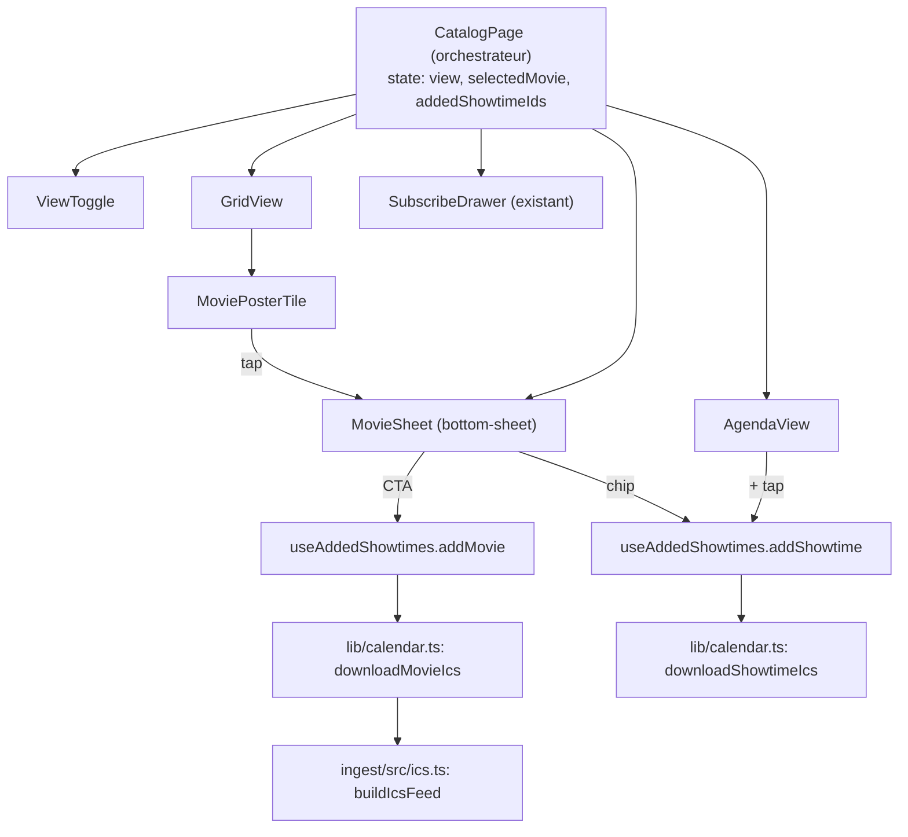

# Refonte du catalogue en 3 vues (Grille + Agenda + Fiche détail) — Plan

> **Base :** branche `main` (l'app vivante : pas de router, primitives framer-motion + Phosphor, thème bi-thème).
> **Type :** `feat` · **Profondeur :** Deep · **Source design :** `Vues catalogue films minimaliste/`

---

## Goal Capsule

- **Objectif :** remplacer la liste mono-vue actuelle du catalogue par 3 vues (Grille par défaut, Fiche détail en bottom-sheet, Agenda chronologique), re-stylées sur la palette/typo de la maquette, avec un abonnement film-entier en un tap.
- **Autorité produit :** Dylan (propriétaire du projet, décideur design).
- **Profil d'exécution :** travail de composants/UI + styling ; preuve par `panda codegen` + `tsc` + `build` + `lint` + matrice de smoke manuelle. Aucun test runner dans le repo côté web (voir Assumptions).
- **Blocages ouverts :** aucun pour l'implémentation. Un chevauchement de fichiers avec la branche `feat/abonnement-filtre` est identifié et doit être coordonné avant tout merge (voir Risques).

---

## Context

Le dossier `Vues catalogue films minimaliste/` (maquette HTML `Plan-Plan Vues.dc.html` + 2 captures) est un rework de la vue catalogue. Aujourd'hui, [web/src/pages/CatalogPage.tsx](web/src/pages/CatalogPage.tsx) affiche une seule liste verticale de [MovieCard](web/src/components/MovieCard.tsx) (affiche à gauche + méta + synopsis + sélecteur de jour + chips d'horaires → `.ics` séance par séance). C'est fonctionnel mais mono-modal et peu « butinable ».

La maquette propose une refonte en 3 vues autour du même job (mettre une séance dans son agenda) :
- **Grille** (nouveau défaut) : butinage visuel 2 colonnes d'affiches.
- **Fiche détail** (bottom-sheet ouvert au tap d'une affiche) : synopsis + CTA « Suivre les N séances » + sélecteur de jour + horaires.
- **Agenda** (2ᵉ vue) : toutes les séances de tous les films, chronologiques par jour.

**Décisions confirmées avec le propriétaire (Dylan) :**
1. Refonte 3 vues complète (fidèle à la maquette HTML), avec bascule Grille ⇄ Agenda, Grille par défaut.
2. Adopter les 2 polices : Schibsted Grotesk (UI) + Spline Sans Mono (micro-labels : version VF/VO/VOST, timestamp de sync, labels de section, badges).
3. Inclure « Suivre les N séances » : nouvelle capacité qui ajoute toutes les séances d'un film en un seul `.ics`.

**Résultat visé :** un catalogue en 2 modes (spatial / temporel), une fiche détail par film, un abonnement film-entier en un tap, le tout re-stylé sur la palette beige/rouge et la typo de la maquette — sans casser le thème sombre existant ni introduire de router.

### Requirements

- R1. Le catalogue propose une vue Grille (2 colonnes, défaut) et une vue Agenda (chronologique), commutables via un toggle persisté.
- R2. Un tap sur une affiche de la Grille ouvre une fiche détail en bottom-sheet (synopsis, sélecteur de jour, horaires).
- R3. La fiche détail offre un CTA « Suivre les N séances » qui télécharge un `.ics` unique couvrant toutes les séances du film.
- R4. L'ajout séance-par-séance (comportement actuel) reste disponible depuis la fiche détail et depuis l'Agenda.
- R5. L'état « séance ajoutée » (✓) est partagé entre les vues (une séance ajoutée en Agenda apparaît ✓ dans la fiche, et réciproquement).
- R6. La palette et la typographie (Schibsted Grotesk + Spline Sans Mono) suivent la maquette, sans régression du thème sombre existant.
- R7. Aucun router n'est introduit ; le catalogue reste une SPA à état local.
- R8. `version` reste un champ texte libre (pas d'enum), la ligne « Synchronisé le… » reste toujours visible, les affiches cassées retombent sur un placeholder.

### Scope Boundaries

- Pas de recherche/filtre/tri dans le catalogue (hors sujet de cette refonte).
- Pas de multi-cinéma actif (le modèle le supporte déjà via `cinemaId`, non testé ici au-delà du cinéma unique existant).
- Pas de `prefers-reduced-motion` sur le stack de sheets (pré-existant, follow-up).

#### Deferred to Follow-Up Work

- Coordination avec `feat/abonnement-filtre` (chevauchement de fichiers + question produit sur la mécanique d'abonnement) — voir Risques.
- Introduction d'un test runner web (vitest) pour les helpers purs — le repo n'en a aucun aujourd'hui côté web.

---

## Planning Contract

### Key Technical Decisions

- **KTD1 — Pas de router.** La vue (`grille`/`agenda`) et l'ouverture de la fiche sont de l'état local dans `CatalogPage`. Conforme à [docs/architecture/frontend-architecture.md](docs/architecture/frontend-architecture.md) (« router seulement quand une URL partageable est nécessaire »). `CatalogPage` reste l'orchestrateur unique : il détient les données, la vue active, le film sélectionné, et l'état « ajouté » — parce que ce dernier doit être visible à la fois depuis la Grille (fiche) et depuis l'Agenda.
- **KTD2 — `.ics` film-entier sans nouveau code d'ingestion.** [ingest/src/ics.ts](ingest/src/ics.ts) exporte déjà `buildIcsFeed(cinema, movies, generatedAt)` (multi-VEVENT). Le helper front `downloadMovieIcs(cinema, movie)` appelle `buildIcsFeed(cinema, [movie], new Date())`. Zéro modif ingest.
- **KTD3 — Thème préservé, on retune uniquement les valeurs `base` (light).** La maquette est light-only. On ajuste les hex `base` des tokens sémantiques de [web/panda.config.ts](web/panda.config.ts) sur la palette maquette et on ne touche à aucune valeur `_dark`. Les nouveaux tokens reçoivent tous une valeur `_dark`.
- **KTD4 — Extraire la logique partagée avant de multiplier les vues.** Les helpers privés de `MovieCard` (`groupShowtimesByDay`, `formatDuration`, les `Intl.DateTimeFormat`) sont montés dans `lib/` et réutilisés par la fiche et l'agenda ; le comportement « télécharger + toast + marquer ajouté » est centralisé dans un hook `useAddedShowtimes`. On n'extrait pas un `<DaySelector>` JSX (un seul consommateur : la fiche — règle de trois non atteinte).
- **KTD5 — Polices self-hosted via `@fontsource`.** SPA statique GitHub Pages → on évite le CDN Google (pas de round-trip tiers, versionné avec le build). Import side-effect dans [web/src/main.tsx](web/src/main.tsx) ; tokens `fonts.body` / `fonts.mono` dans Panda. `font-display: swap` → pas de blocage ; le script anti-FOUC de thème n'est pas touché (il ne gère que `data-theme`).

### High-Level Technical Design



### Architecture des composants

Tous les chemins sous `web/src/`.

| Fichier | Type | Rôle |
|---|---|---|
| `lib/datetime.ts` | nouveau (pur) | `Intl.DateTimeFormat` mutualisés + `formatTime`, `formatDuration`, `dayKeyOf(iso)`, `formatDayTab(iso)`, `formatDayHeading(iso, todayKey)` (→ `"Aujourd'hui"` / `"Mercredi 15"`), `formatShortSync`. Tue la duplication MovieCard/CatalogPage. |
| `lib/showtimes.ts` | nouveau (pur) | `groupShowtimesByDay` (déplacé), `buildAgendaByDay(movies, cinemas): AgendaDay[]`, `seanceCountLabel(n)`, `nextShowtimeShort(showtimes, todayKey)`. |
| `hooks/useCatalogView.ts` | nouveau | `[view, setView]` (`'grille'|'agenda'`), persisté `localStorage` (clé `planplan-view`), défaut `grille`. Modèle : [web/src/lib/theme.ts](web/src/lib/theme.ts). |
| `hooks/useAddedShowtimes.ts` | nouveau | `Set<string>` d'ids ajoutés + `addShowtime(cinema, movie, showtime)`, `addMovie(cinema, movie)` (marque toutes les séances), `isAdded(id)`. Éphémère (comme l'actuel). |
| `components/Poster.tsx` | nouveau | `` avec état `hasError` interne → placeholder rayé/teinté (URL cassée ou `posterUrl` absent). Remplace les 3 blocs `onError` dupliqués (tuile 2/3, fiche 84×120, agenda 38×54). |
| `components/ViewToggle.tsx` | nouveau | Pilule segmentée Grille/Agenda, `role="tablist"`. Actif = `bg:paper` + `color:accentText` (s'inverse dans les 2 thèmes). |
| `components/GridView.tsx` | nouveau | Grille responsive de `MoviePosterTile` ; `onSelectMovie(movie, triggerEl)`. |
| `components/MoviePosterTile.tsx` | nouveau | `<button aria-haspopup="dialog">` : `Poster` (2/3) + tag version mono (haut-droite, translucide) + pastille rouge du nombre de séances (bas-gauche) + titre + ligne « prochaine séance » atténuée. |
| `components/MovieSheet.tsx` | nouveau | Fiche détail bottom-sheet — clone du scaffold [SubscribeDrawer](web/src/components/SubscribeDrawer.tsx). Header (Poster 84×120 + titre + tag version bordé mono + méta), synopsis, CTA rouge plein « Suivre les N séances » → `addMovie` + texte d'aide, séparateur, label maj. « Ou choisir un jour », carousel de chips-jour + chips d'horaires du jour → `addShowtime`. |
| `components/AgendaView.tsx` | nouveau | `AgendaDay[]` → en-têtes de jour `<h2>` sticky (opaques) + lignes (heure / `Poster` 38×54 / titre ellipsé / `version · genre` / bouton rond `+`→`✓`) → `addShowtime`. |
| `pages/CatalogPage.tsx` | modif | Orchestre : chrome (wordmark, ThemeMenu, icône calendrier, ligne « Synchronisé le… »), `ViewToggle`, `GridView`/`AgendaView`, `MovieSheet`, `SubscribeDrawer`, `useAddedShowtimes`. |
| `panda.config.ts` | modif | Retune `base` + nouveaux tokens `colors`/`fonts`/`radii` (voir plus bas). |
| `main.tsx` | modif | Imports side-effect des polices `@fontsource`. |
| `lib/calendar.ts` | modif | Ajout `downloadMovieIcs` ; élargit l'import à `buildIcsFeed`. |
| `components/MovieCard.tsx` | supprimé | Layout absent des 3 vues cibles ; logique extraite en `lib/`. Supprimé après l'extraction (U8). |

**Shape Agenda** (`lib/showtimes.ts`) :
```
type AgendaEntry = { showtime: Showtime; movie: Movie; cinema: Cinema }
type AgendaDay   = { dayKey: string; entries: AgendaEntry[] }
buildAgendaByDay(movies, cinemas):
  → Map<cinemaId, Cinema> ; flatten toutes movie.showtimes en AgendaEntry
    (skip si cinema introuvable, comme le .find actuel de CatalogPage) ;
    tri global par startsAt ↑ (le flatten entrelace les films) ;
    groupe en buckets de jour (dayKeyOf), ordre d'insertion = chronologique.
```
On garde les refs `movie`/`cinema` complètes (pas de champs aplatis) → la ligne lit `movie.posterUrl/title/version/genres` et le bouton appelle `downloadShowtimeIcs(cinema, movie, showtime)` sans re-lookup.

### Tokens & palette (`panda.config.ts`)

**Retune `base` (ne touche AUCUN `_dark`) :** `ink → #efe8da` (fond écran = fond page, l'app n'a pas de cadre téléphone), `paper → #1b1a17`, `accent → #a4192c`, `surfaceSheet → #faf6ee`, `success → #2f9e5f`. (`surface #fffdf9` correspond déjà. `paperMuted`/`paperFaint` en alpha s'adaptent au nouveau `ink` — n'ajuster que si un smoke montre une dérive.)

**Nouveaux tokens `colors`** (chacun avec un `_dark`) : `accentHover` (base `#7d1321`, hover CTA/liens), `paperBody` (base `#57503f`, corps de synopsis dans la fiche), `scrim` (base `rgba(14,13,11,0.42)` — refactore le `rgba(...)` codé en dur de [Backdrop.tsx](web/src/components/Backdrop.tsx), partagé fiche + drawer), `posterTagBg` (`rgba(0,0,0,0.42)`, tag version sur affiche).

**Nouveaux tokens `radii`** (les rayons maquette ne mappent pas les presets Panda) : `poster: 12px`, `chip: 11px`, `button: 13px`, `sheet: 26px`, `thumb: 6px`. Laisse `MovieSheet`/`SubscribeDrawer` partager `rounded: 'sheet'`.

**Nouveaux tokens `fonts`** : `body: "'Schibsted Grotesk Variable', system-ui, sans-serif"`, `mono: "'Spline Sans Mono Variable', ui-monospace, monospace"` (vérifier le nom exact de famille dans le CSS du package installé). `globalCss.body.fontFamily` → réf token `body`. Micro-labels mono via `fontFamily: 'mono'`.

**Espacement :** on garde l'échelle preset Panda (pas de scale custom) ; px maquette → token le plus proche (16→`4`, 14→`3.5`, 8→`2`).

Ajouter les catégories `fonts`/`radii` (pas seulement des couleurs) impose un `panda codegen` — 1ʳᵉ étape de vérif de chaque unité.

### Assumptions

- Pas de test runner web (repo → vitest seulement dans `ingest`). Vérif comportementale = codegen + typecheck + build + lint + smoke manuel. Les helpers (`lib/datetime.ts`, `lib/showtimes.ts`) sont extraits purs pour rester testables si un runner web est introduit plus tard (déféré).

---

## Implementation Units

Vocabulaire de vérif (pas de test runner web) : **CG** `npm run prepare` (panda codegen) · **TS** `npm run typecheck` · **B** `npm run build` · **L** `npm run lint` (oxlint) · **SM** smoke manuel `npm run dev`, les 2 thèmes, mobile (≤768) + desktop.

### U1. Tokens design + radii + scrim (fondation)

- **Goal :** palette/rayons maquette dispo en tokens ; thème sombre inchangé.
- **Requirements :** R6, R8.
- **Dependencies :** aucune.
- **Files :** [web/panda.config.ts](web/panda.config.ts), [web/src/components/Backdrop.tsx](web/src/components/Backdrop.tsx) (→ `bg:'scrim'`).
- **Approach :** retune hex `base` ; ajoute `accentHover`/`paperBody`/`scrim`/`posterTagBg` ; ajoute `tokens.radii`. Relance `panda codegen`.
- **Patterns to follow :** structure `theme.extend` + `semanticTokens` existante de `panda.config.ts` (KTD1 du plan thème `docs/plans/2026-07-12-002-feat-cinema-red-light-theme-plan.md`).
- **Test scenarios :** Test expectation: none — unité de tokens/config. Preuve : CG sans erreur, TS/B verts.
- **Verification :** CG, TS, B ; SM — l'app actuelle rend en light (nouveaux hex) et en dark (identique à avant) ; le scrim du SubscribeDrawer assombrit correctement dans les 2 thèmes.

### U2. Polices (Schibsted Grotesk + Spline Sans Mono)

- **Goal :** typo maquette, self-hosted.
- **Requirements :** R6.
- **Dependencies :** U1 (même fichier config).
- **Files :** [web/package.json](web/package.json) (deps `@fontsource-variable/schibsted-grotesk`, `@fontsource-variable/spline-sans-mono` — fallback `@fontsource/spline-sans-mono` 400/500 si le variable n'existe pas), [web/src/main.tsx](web/src/main.tsx) (imports), [web/panda.config.ts](web/panda.config.ts) (`tokens.fonts`, `globalCss.body.fontFamily:'body'`), [web/src/components/SubscribeDrawer.tsx](web/src/components/SubscribeDrawer.tsx) (badge mono codé en dur → token `mono`).
- **Patterns to follow :** imports side-effect existants dans `main.tsx`.
- **Test scenarios :** Test expectation: none — config/styling. Preuve : SM.
- **Verification :** CG, TS, B ; SM — corps en Schibsted, badge URL en Spline Sans Mono ; pas de FOUC au-delà du `swap` ; aucune requête réseau CDN (self-hosted) ; pas de flash de thème.

### U3. Extraction des helpers purs (filet de sécurité)

- **Goal :** un seul foyer pour la logique date/séances, sans changement visuel.
- **Requirements :** R1 (fondation), R5 (fondation).
- **Dependencies :** aucune (peut paralléliser U1/U2).
- **Files :** nouveaux `web/src/lib/datetime.ts`, `web/src/lib/showtimes.ts` ; refactor [web/src/components/MovieCard.tsx](web/src/components/MovieCard.tsx) + [web/src/pages/CatalogPage.tsx](web/src/pages/CatalogPage.tsx) pour importer depuis eux (MovieCard existe encore ici).
- **Approach :** déplace `groupShowtimesByDay`/`formatDuration`/formatters ; ajoute `buildAgendaByDay`, `seanceCountLabel`, `nextShowtimeShort`, `formatDayHeading`.
- **Patterns to follow :** utilitaires purs existants de [web/src/lib/](web/src/lib/) (`theme.ts`, `calendar.ts`).
- **Test scenarios :**
  - Happy (SM) : le sélecteur de jour + chips + toast de MovieCard se comportent exactement comme avant (refactor pur, zéro diff visuel).
  - Edge : `groupShowtimesByDay` sur film à séances multi-jours → ordre chronologique conservé (l'ingestion pré-trie).
  - Edge : `nextShowtimeShort` avec 1 séance aujourd'hui → `"auj."` ; avec séances futures → `"dès mer. 15"`.
- **Verification :** TS, B, L ; SM iso-comportement.

### U4. `downloadMovieIcs` + `useAddedShowtimes`

- **Goal :** `.ics` film-entier + comportement ajout/toast/toggle partagé.
- **Requirements :** R3, R4, R5.
- **Dependencies :** U3 (`seanceCountLabel`).
- **Files :** [web/src/lib/calendar.ts](web/src/lib/calendar.ts) (ajout helper + import `buildIcsFeed`), nouveau `web/src/hooks/useAddedShowtimes.ts`.
- **Approach :** `downloadMovieIcs(cinema, movie)` = `downloadIcsFile(buildIcsFeed(cinema, [movie], new Date()), \`${movie.id}.ics\`)`. Hook : `addShowtime` (télécharge séance + toast + marque 1 id), `addMovie` (télécharge film + `showToast('✓ ' + seanceCountLabel(n) + ' ajoutées…')` + marque tous les ids), `isAdded`.
- **Patterns to follow :** [lib/calendar.ts](web/src/lib/calendar.ts) (`downloadShowtimeIcs`, `downloadIcsFile`), [context/ToastContext.tsx](web/src/context/ToastContext.tsx).
- **Test scenarios :**
  - Happy : Covers AE (film à N séances). `downloadMovieIcs` sur film à N séances → 1 fichier `.ics` contenant N VEVENT (ouvrir le fichier généré pour confirmer, en dev, non commité).
  - Happy : `addMovie` marque toutes les séances du film comme ajoutées → `isAdded` vrai pour chacune.
  - Edge : film à 1 séance → `.ics` à 1 VEVENT, toast au singulier « 1 séance ajoutée ».
  - Edge : re-tap → re-télécharge (cohérent avec l'actuel), pas de doublon d'état.
- **Verification :** TS, B, L ; smoke des call-sites différé à U6/U7.

### U5. `Poster` + `ViewToggle` + `useCatalogView`

- **Goal :** primitives feuilles dont les vues dépendent.
- **Requirements :** R1, R8.
- **Dependencies :** U1 (tokens), U3 (facultatif).
- **Files :** nouveaux `web/src/components/Poster.tsx`, `web/src/components/ViewToggle.tsx`, `web/src/hooks/useCatalogView.ts`.
- **Approach :** `Poster` gère `hasError` → placeholder (motif rayé réutilisé de MovieCard, via token `hairline`) ; `ViewToggle` tablist ; `useCatalogView` calqué sur [lib/theme.ts](web/src/lib/theme.ts) (guard `isCatalogView`, clé `planplan-view`, try/catch défensif).
- **Patterns to follow :** boutons/tags de MovieCard ; persistance de `theme.ts`.
- **Test scenarios :**
  - Happy : le toggle bascule son `aria-selected` et persiste au reload.
  - Edge : `Poster` avec URL délibérément cassée → placeholder ; avec `posterUrl` absent → placeholder.
  - A11y : `ViewToggle` en `role="tablist"`, `aria-selected` sur l'onglet actif, cible tactile suffisante ; actif discernable sans la couleur (fond plein).
- **Verification :** TS, B, L ; SM toggle + placeholders.

### U6. GridView + MoviePosterTile + MovieSheet (câblés dans CatalogPage)

- **Goal :** vue Grille par défaut + fiche détail. (Agenda masqué/stub jusqu'à U7.)
- **Requirements :** R1, R2, R3, R4, R8.
- **Dependencies :** U1, U2, U3, U4, U5.
- **Files :** nouveaux `GridView.tsx`, `MoviePosterTile.tsx`, `MovieSheet.tsx` ; modif [CatalogPage.tsx](web/src/pages/CatalogPage.tsx) (détient view + selectedMovie + triggerRef + `useAddedShowtimes` ; rend chrome + ViewToggle + GridView + MovieSheet + SubscribeDrawer).
- **Approach :** grille `gridTemplateColumns: repeat(auto-fill, minmax(150px, 1fr))` (2 col. mobile, ~5 à 860px). `MovieSheet` clone le scaffold `SubscribeDrawer` (`wrapperClass pointerEvents:none` + `AnimatePresence` + `DraggableSheet` + `useModalFocusTrap({open,onClose,containerRef:sheetRef,triggerRef})`). CTA → `addMovie` ; chips-jour (`role="tablist"`/`tab`) + chips-horaire → `addShowtime`. Tap tuile : capture `event.currentTarget` dans `triggerRef` pour restaurer le focus à la fermeture.
- **Patterns to follow :** [SubscribeDrawer.tsx](web/src/components/SubscribeDrawer.tsx) (scaffold + a11y dialog), [DraggableSheet.tsx](web/src/components/DraggableSheet.tsx), [useModalFocusTrap.ts](web/src/hooks/useModalFocusTrap.ts), sélecteur de jour de l'ex-MovieCard.
- **Test scenarios :**
  - Happy : grille 2 col. mobile / multi-col. desktop ; tap tuile → fiche par-dessus le scrim.
  - Happy : CTA « Suivre les N séances » → 1 `.ics` multi-événements + toast + toutes les chips passent ✓.
  - Happy : tap 1 chip d'horaire → 1 `.ics` séance + ✓.
  - Edge : affiche cassée dans la tuile → placeholder, tag version + pastille comptage restent lisibles.
  - A11y : `aria-haspopup="dialog"` sur la tuile ; `role="dialog" aria-modal` + focus trap ; Escape / backdrop / drag-dismiss ferment et restaurent le focus sur la tuile.
  - Chrome : wordmark + ligne « Synchronisé le… » + ThemeMenu + icône calendrier (ouvre SubscribeDrawer) présents.
- **Verification :** CG, TS, B, L ; SM matrice ci-dessus, 2 thèmes.

### U7. AgendaView

- **Goal :** 2ᵉ vue chronologique.
- **Requirements :** R1, R4, R5, R8.
- **Dependencies :** U3, U4, U5, U6 (orchestrateur en place).
- **Files :** nouveau `AgendaView.tsx` ; modif [CatalogPage.tsx](web/src/pages/CatalogPage.tsx) (rend AgendaView si `view==='agenda'`).
- **Approach :** `buildAgendaByDay` + en-têtes `<h2>` sticky opaques (`bg:'ink'` + `zIndex`) + lignes + bouton rond `+`→`✓` → `addShowtime`. Colonne interne `maxW ~600px` centrée (lisibilité) même si la page fait 860.
- **Patterns to follow :** grouping de `lib/showtimes.ts` ; boutons de l'ex-MovieCard.
- **Test scenarios :**
  - Happy : jours chronologiques, `"Aujourd'hui"` pour le jour courant ; lignes heure/thumb/titre/`version · genre`.
  - Happy : `+`→`✓` au tap + toast ; une séance ajoutée en Agenda apparaît ✓ quand on ouvre la fiche du film en Grille (`useAddedShowtimes` partagé).
  - Edge : en-têtes sticky restent opaques par-dessus les lignes défilées, dans les 2 thèmes.
  - A11y : bouton d'ajout `aria-label="Ajouter la séance de {titre} le {jour} à {heure}…"`, `aria-pressed` après ajout ; glyphe `aria-hidden`.
- **Verification :** CG, TS, B, L ; SM.

### U8. Suppression de MovieCard + nettoyage

- **Goal :** retirer le code mort.
- **Requirements :** — (nettoyage).
- **Dependencies :** U3 (logique extraite), U6/U7 (vues en place).
- **Files :** supprime [web/src/components/MovieCard.tsx](web/src/components/MovieCard.tsx) ; vérifie qu'aucun import ne subsiste.
- **Test scenarios :** Test expectation: none — suppression. TS/B échouent bruyamment sur tout import pendant.
- **Verification :** TS, B, L ; SM matrice complète finale — catalogue vide, film à 0 séance future, affiche cassée, long carousel multi-semaines, 2 thèmes, mobile + desktop, les 2 vues + fiche.

---

## Edge cases & risques

- **Catalogue vide / 0 film :** garder les guards actuels de CatalogPage (ligne « Synchronisé » + accroche `"Les séances du cinéma, direct dans ton agenda."` ; icône calendrier seulement si `cinemas.length > 0`). GridView/AgendaView rendent un état vide (`"Aucune séance à venir"`).
- **Film sans séance future :** filtrer en amont de GridView (absent naturellement de `buildAgendaByDay`). Une tuile sans pastille/CTA serait une impasse.
- **Long carousel de jours :** longueur = jours distincts ayant des séances (le grouping élague les jours vides) → borné (~2 semaines). `overflowX:auto` + `scrollIntoView` de la chip sélectionnée. La « barre de progression » vue sur les captures est un simple affordance de scroll — optionnel, pas requis.
- **`version` = texte libre :** rendre `movie.version?.trim()` verbatim dans le tag mono ; omettre si absent. Ligne agenda = `[version?.trim(), genres[0]].filter(Boolean).join(' · ')`. Jamais d'enum, jamais de group-by version.
- **Desktop :** maquette = 344px mobile ; app responsive `maxW:860px`. Grille `auto-fill minmax(150px,1fr)` ; Agenda colonne `maxW ~600px` ; `MovieSheet` reste un bottom-sheet `maxW:480px` centré-bas sur toutes tailles (comme SubscribeDrawer).
- **`prefers-reduced-motion` :** le stack de sheets ne l'honore pas (pré-existant) — hors périmètre, follow-up.

### Chevauchement avec `feat/abonnement-filtre` (à coordonner AVANT tout merge)

La branche en cours `feat/abonnement-filtre` (plan `docs/plans/2026-07-03-001-feat-abonnement-filtre-plan.md`) édite déjà `calendar.ts`, `panda.config.ts`, `App.tsx`, `CatalogPage.tsx`, MovieCard.tsx et ajoute `lib/movieSelection.ts` + `useMovieSelection` + `ManageSubscriptionPage.tsx`. Or cette refonte supprime MovieCard et réécrit CatalogPage. Conflit quasi-total sur ces fichiers, + deux mécaniques d'abonnement concurrentes (« suivre le film entier » ici vs « abonnement filtré des films sélectionnés » là-bas).

**Recommandation :** ne pas développer en parallèle — merger une branche, rebaser l'autre ; réutiliser `movieSelection.ts` comme template littéral de `useCatalogView` ; trancher côté produit si le CTA « Suivre le film » doit alimenter la sélection filtrée plutôt que d'émettre un `.ics` one-shot séparé.

---

## Verification Contract

| Gate | Commande | Portée |
|---|---|---|
| Codegen tokens | `npm run prepare` (panda codegen) | U1, U2, U5–U7 (nouveaux tokens/classes) |
| Types | `npm run typecheck` (`tsc -b`) | Toutes |
| Build | `npm run build` | Toutes |
| Lint | `npm run lint` (oxlint) | Toutes |
| Smoke manuel | `npm run dev` + matrice ci-dessous | U3, U5–U8 |

**Matrice de smoke (fin U8) :** défaut = Grille 2 col. mobile / multi-col. desktop ; tap affiche → fiche (scrim, focus trap, Escape/backdrop/drag ferment + restaurent focus) ; CTA → 1 `.ics` N-VEVENT + toast + chips ✓ ; 1 chip → 1 `.ics` + ✓ ; bascule Agenda persiste au reload ; Agenda chronologique + `"Aujourd'hui"` + sticky opaque + `+`→`✓` ; état ajouté partagé Grille↔Agenda ; catalogue vide, film 0-séance filtré, affiche cassée → placeholder ; thème sombre identique à avant ; polices Schibsted + Spline Sans Mono, aucune requête CDN.

## Definition of Done

- 3 vues opérationnelles : Grille (défaut, 2 col. mobile), Fiche détail (bottom-sheet), Agenda (chronologique) + bascule persistée.
- « Suivre les N séances » télécharge 1 `.ics` couvrant toutes les séances du film ; ajout séance-par-séance conservé ; état « ajouté » partagé entre vues.
- Palette maquette appliquée aux valeurs `base` ; thème sombre visuellement inchangé (`_dark` intacts) ; polices Schibsted Grotesk + Spline Sans Mono self-hosted, mono sur les micro-labels.
- Aucun router ajouté ; `CatalogPage` orchestrateur unique ; `MovieCard.tsx` supprimé, aucun import pendant.
- Styling 100 % tokens (aucune valeur codée en dur — `scrim`, `radii`, `fonts` tokenisés) ; `version` rendu en texte libre ; ligne « Synchronisé le… » toujours visible ; affiches avec `onError` → placeholder ; `BASE_URL` pour les assets.
- A11y : tuile `aria-haspopup="dialog"` ; fiche `role="dialog" aria-modal` + focus trap + restauration focus ; toggle `tablist` ; boutons agenda labellisés.
- `panda codegen`, `typecheck`, `build`, `lint` verts ; matrice de smoke passée (2 thèmes, mobile + desktop).
- Chevauchement `feat/abonnement-filtre` explicitement coordonné (une branche mergée, l'autre rebasée) avant merge.
